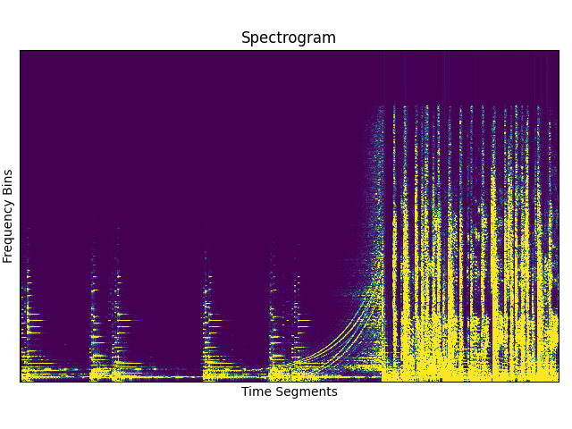
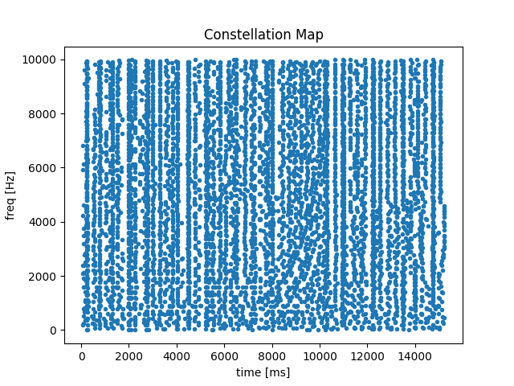

# Muse: An Implementation of the Shazam Algorithm in C
Muse is an implementation of the Shazam algorithm for music recognition, as described in the paper 
["An Industrial-Strength Audio Search Algorithm" by Avery Li-Chun Wang](https://www.ee.columbia.edu/~dpwe/papers/Wang03-shazam.pdf). This project allows 
you to archive `.wav` files into binary files for music recognition and recognize music using a microphone.

The code is written in C, using MSVC and Visual Studio, with OpenMP enabled by default for parallel processing. It has been tested on Windows x64 but should work on other platforms as well.

## Setup Instructions Using CMake

Follow these steps to build and run the Muse project using **CMake**.

### 1. Clone the Repository
Clone this repository to your local machine:

```console
git clone https://github.com/Michael-MD/Muse.git
cd muse
```

### 2. Install Dependencies

Muse requires the following tools:

- **CMake** (version 3.10 or higher)
- **C compiler** (MSVC for Windows, GCC for Linux/macOS)
- **OpenMP support** (enabled by default in most modern compilers)

For **Windows** users, it's recommended to have **Visual Studio** installed with CMake support.  
For **Linux/macOS** users, ensure that **GCC** is installed.

### 3. Setup using CMake
1. Open the CMake gui,
2. Select Muse root directory for "Where is the source code:" which contains the CMakeLists.txt file.
3. Select the ./build directory for "Where to build binaries:".
4. Click configure, several flags should appear.
5. I personally disabled all flags except:
   - BUILD_PROGRAMS,
   - DISABLE_FORTRAN,
   - ENABLE_CPACK,
   - ENABLE_EXTERNAL_LIBS,
   - ENABLE_FLOAT,
   - ENABLE_OPENMP,
   - ENABLE_PACKAGE_CONFIG,
   - INSTALL_MANPAGES,
   - INSTALL_PKGCONFIG_MODULE,
   - PA_BUILD_STATIC,
   - PA_UNICODE_BUILD,
   - PA_USE_DS,
   - PA_USE_WASAPI,
   - PA_USE_WDMKS,
   - PA_USE_WMME.
6. Click generate and select the build system. Personally, I choose "Visual Studio 17 2022" for windows.
7. Open the solution file and build all in release mode. Navigate to the Muse release .exe file.

## Usage Instructions
Muse has a basic command line interface which I will walk you through using.

First music which you want Muse to recognize must be processed first to generate binary files containing the "essence" of the 
music. I refer to this process as archiving.

### Archiving Music
1. Collect music .wav files in single directory.
2. Open Muse in console and type:
```console
Muse -a "dir/to/wav/files/" -a "dir/to/store/archived/files/"
```
The first directory is the location of the .wav files, the second directory is where the archived data will be stored.

### Music recognition
Open Muse in console and type:
```console
Muse -l "dir/to/archived/music/"
```
MAKE SURE YOU USE FORWARD SLASHES AND ADD A SLASH AT THE END.

In summary:
Usage:
  [-h] [-l <src_dir>] [-a <src_dir> <dst_dir>] [-a <src_dir> <dst_dir>]

Options:
  -h, --help                Display this help message
  -l, --startListening=<src_dir>    Begins listening through microphone for audio using directory containing archived tracks.
  -a, --archiveTracks=<src_dir> <dst_dir>    Archives a directory of .wav tracks to be used for music recognition.

## Troubleshoting
### Muse keeps telling me the directory cannot be found
Make sure the directory exists but more likely, MAKE SURE TO USE FORWARD SLASHES ONLY AND HAVE A FORWARD SLASH AT THE END. For example,
the following will not work
- dir\to\archived\music
- dir\to\archived\music\
- dir/to/archived/music

This **WILL** work:
- dir/to/archived/music/

### Muse cannot recognise the music I'm playing
If you are on windows, then the issue is very likely the pre-proecssing windows does to the audio. This completely ruins it. 
To turn this off, this can be done as follows:
1. Open settings
2. Navigate to System > Sound > All sound devices > Properites
3. Click on your microphone and turn "Audio enhancement" off.

## TODO:
There are some 'nice-to'have" features I've neglected so if you want to take up the mantle, please be my guest.

- [ ] **Optimize database lookup** by taking advantage of binary files stored in hash order for faster comparisons.
- [ ] Implement additional testing on macOS and Linux platforms.
- [ ] Consider adding support for more audio formats (e.g., MP3, OGG).
- [ ] Improve documentation and add more detailed error handling.
- [ ] Implement variable fanout into target zone.

## Contributing
If you would like to contribute to Muse, feel free to submit a pull request. To help you get started, here are some guidelines:

1. **Fork the repository** and clone your fork locally.
2. **Create a new branch** for your feature or bugfix.
3. **Make your changes** in the new branch.
4. **Test your changes** thoroughly to ensure nothing else is broken.
5. **Commit your changes** with clear and concise commit messages.
6. **Push your changes** to your forked repository.
7. **Submit a pull request** describing your changes and why they should be merged.

### Code Style
- Please follow the existing code style and formatting conventions.
- Add **comments** to explain complex code or logic.
- Ensure that your code is **well-documented** by adding docstrings to functions and line-by-line explanations for logic.
- variable names and functions use snake case for functions and variables.
- If any memory is allocated on the stack by a function, ensure this is in the docstring.
- If you make a new data structure use the _t post-fix convention and create init and free functions for easy memory handling.

## How It Works

The Shazam algorithm implemented in Muse follows several key steps to recognize music. For additional detail consider reading 
["An Industrial-Strength Audio Search Algorithm" by Avery Li-Chun Wang](https://www.ee.columbia.edu/~dpwe/papers/Wang03-shazam.pdf). 
Here's an overview of the process:

### 1. Spectrogram Generation
The first step in the Shazam algorithm is to generate a **spectrogram** of the audio signal. 
A spectrogram is a visual representation of the spectrum of frequencies in a sound signal as it varies with time. 
This captures both the amplitude and frequency information, which is essential for identifying unique patterns in the audio.



### 2. Constellation Map
From the spectrogram, we generate a **constellation map**. 
A window of specified width and height is shifted across the spectrogram identifying the peak in each region. The time
in the music this occurs and the freqeuncy are stored. 



### 3. Combinatorial Pairing

Next, we create **combinatorial pairs** from the constellation map. 
Nearby pairs of peaks in the constellation map are paired.
Achnor points are chosen which are centered on target zones, each point in the target zone is paried with the corresponding anchor point.
Each pair consists of two peaks (frequencies), and a unique identifier (hash) is generated for each pair. 
These pairs are an efficient way to represent the key features of the audio signal, enabling quick comparisons against a large database of known tracks.
The anchor point time from the beginning of the audio track is also stored although this is **NOT** part of the hash.

### 4. Hashing & Lookup
The binary representation of the combinatorial pairs is stored in a binary file. This completes the "archiving" process.
This allows the system to quickly search the binary database for matches when new audio is processed. 
The pairs are indexed by their hash values which could enabling fast retrieval and comparison (not yet implemented).

### 5. Recognition
The final step is **recognition**. When audio is fed into the system (either through a microphone or from archived data), 
the generated pairs are hashed and compared to the pairs in the database. This is kept track of using a histogram. The system determines the track with the highest 
match percentage and identifies the song based on the standard deviation of the peak from the mean.


## Citation

If you use this code in your work, please cite the following paper:

Wang, A. L.-C. (2003). *An Industrial-Strength Audio Search Algorithm*. *Proceedings of the International Conference on Music Information Retrieval (ISMIR)*, 2003. Available at: [https://www.ee.columbia.edu/~dpwe/papers/Wang03-shazam.pdf](https://www.ee.columbia.edu/~dpwe/papers/Wang03-shazam.pdf)


